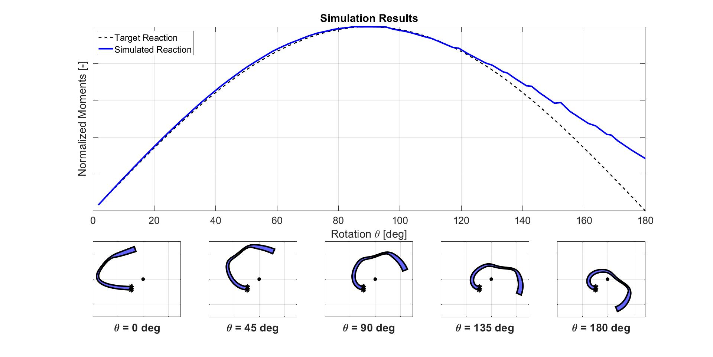

## Introduction
The application presented here is a custom VB.NET app I wrote as part of my Ph.D. thesis. Very broadly, the work involves the development of an optimization-simultion framwork seeking to identify flexure designs that can provide prescribed reaction loads for a given set of kinematic constraints.

The app is called from a MATLAB optimization script that evaluates a cost function based on the results of a nonlinear simulation ran in SolidWorks. The app loads information regarding flexure geometry from an Excel file that was written in the MATLAB script. The app then automates the creation of a 3D geometry based on this information, and performs the aforementioned nonlinear simulation. Nodal reaction loads are then written to another Excel spreadsheet, to be interpretted back in MATLAB.

## Some specifics
Providing some additional details: The simulations are performed in 3D, but the model is constrained such that deformation is planar (effectively 2D). The boundary conditions are as follows: one end of the flexure is kinematically fixed, or "clamped" (i.e., no translations OR rotation at that end); the other end (face, or edge depending on if this is thought of in 3D or 2D respectively) is provided a displacement condition - more specifically, a rotational displacement condition, such that the face is rotated about a remote axis of rotation by 180 degrees clockwise. 

The reaction load to be examined is the moment at the remote axis of rotation caused by the flexure; calculations are performed based on nodes at the fixed base of the flexure. This reaction moment is compared to a reference trajectory - in this case, a sinusoid. The flexures being simulated here are modelled based on material properties similar to TPU (a material that's easy to use when 3D printing).

